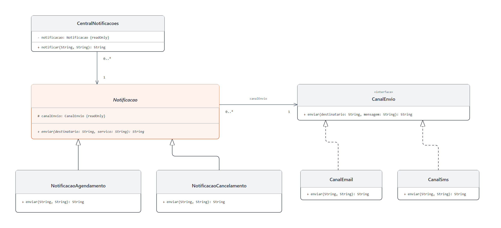

# DCC078 - Padrões de Projeto: Bridge

**Aluno:** Felipe Lazzarini Cunha

## Tema

O projeto representa notificações de agendamento e cancelamento de serviços por e-mail ou SMS. O Bridge permite combinar os tipos de notificação com os canais de envio de forma independente. O envio é simulado por mensagens de texto.

## Diagrama de Classes UML



## Estrutura do Projeto

- `Notificacao`: abstração que mantém a ponte com `CanalEnvio`.
- `NotificacaoAgendamento` e `NotificacaoCancelamento`: abstrações refinadas que definem o conteúdo da mensagem.
- `CanalEnvio`: interface de implementação do envio.
- `CanalEmail` e `CanalSms`: implementações concretas dos canais.
- `CentralNotificacoes`: cliente que utiliza uma notificação sem conhecer seu canal.

## Testes

Com JDK 11 ou superior e Maven:

```bash
mvn test
```
